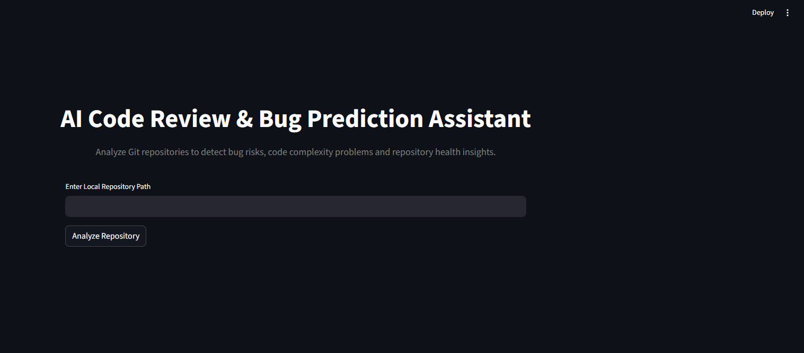
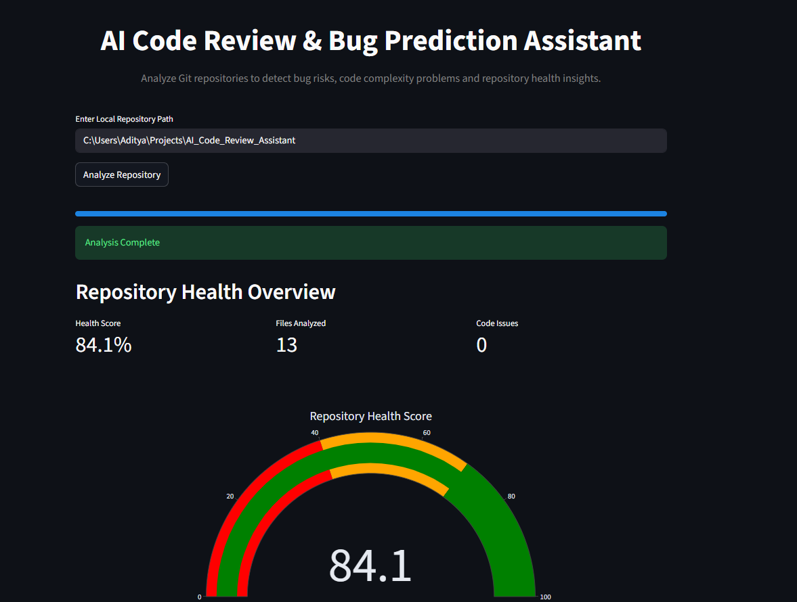
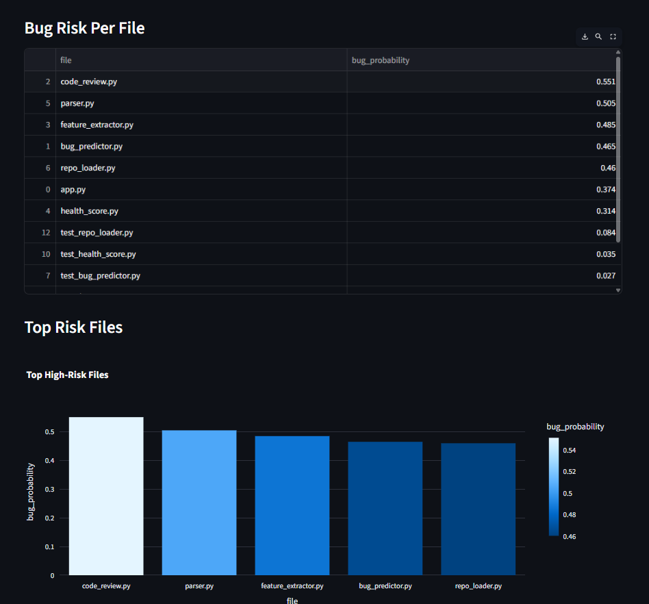
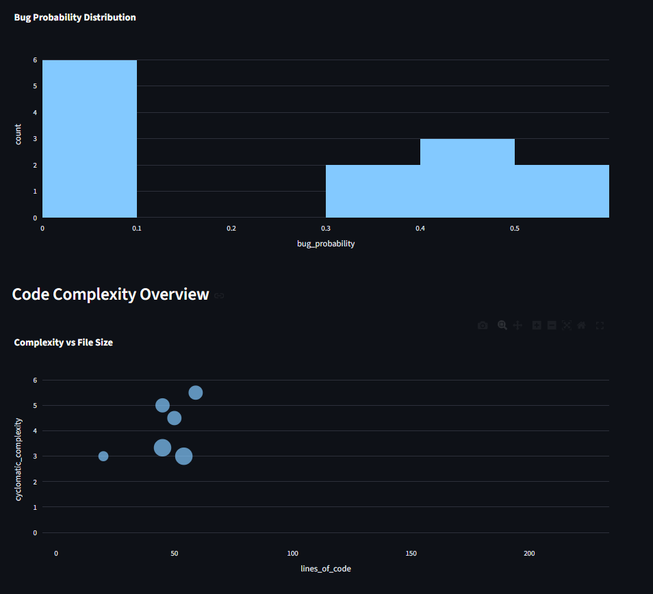
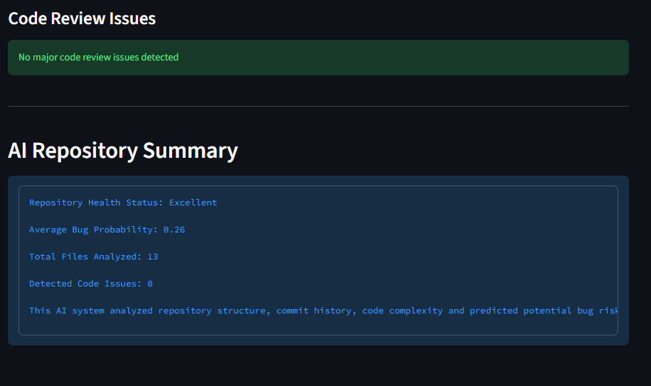

# AI Code Review & Bug Prediction Assistant

<p align="center">


</p>

<p align="center">

<a href="https://ai-code-review-assistantt.streamlit.app/">

</a>


</p>

---

# Live Demo

🚀 **Try the application**

https://ai-code-review-assistantt.streamlit.app/

Analyze **any GitHub repository** or run the **built-in demo repository**.

---

# Overview

Software defects often arise from:

- High code complexity  
- Large files and functions  
- Frequently modified components  

This project automatically analyzes repositories and highlights:

- High-risk files  
- Code complexity problems  
- Repository health score  
- Maintainability insights  

All results are presented through an **interactive Streamlit dashboard**.

---

# Features

## Repository Analysis

- Loads Git repositories  
- Extracts commit history  
- Computes file change frequency  

## Code Parsing

- Parses Python source files  
- Extracts functions and classes using **Python AST**

## Feature Extraction

Computes important metrics:

- Lines of Code (LOC)  
- Cyclomatic Complexity  
- Function Count  
- Change Frequency  

## Bug Risk Prediction

Uses **machine learning** to estimate:

- Bug probability per file  
- Risk-prone modules  

## Automated Code Review

Detects maintainability issues such as:

- Highly complex functions  
- Long methods  
- Code quality problems  

## Repository Health Score

Calculates overall repository health based on:

- Code complexity  
- Bug risk  
- Code issues  

## Interactive Dashboard

The Streamlit interface provides:

- Repository health score gauge  
- Bug probability charts  
- Complexity scatter plots  
- High-risk file detection  
- AI generated repository summary  

---

# Tech Stack

### Language
Python

### Libraries
- Streamlit  
- Plotly  
- GitPython  
- Radon  
- Pandas  
- NumPy  
- Scikit-learn  

---

# Project Structure

```
AI-Code-Review-Assistant
│
├── app.py
├── repo_loader.py
├── parser.py
├── feature_extractor.py
├── bug_predictor.py
├── code_review.py
├── health_score.py
│
├── models/
├── embeddings/
│
├── screenshots/
└── README.md
```

---

# Installation

Clone repository

```bash
git clone https://github.com/Aditya-227/AI-Code-Review-Assistant.git
```

Navigate to project

```bash
cd AI-Code-Review-Assistant
```

Install dependencies

```bash
pip install -r requirements.txt
```

---

# Run the Application

Start the Streamlit dashboard

```bash
streamlit run app.py
```


# Screenshots












# Future Improvements

- LLM-based automated code review  
- Function-level bug prediction  
- Commit activity visualization  
- Cross-repository duplicate code detection  

---

# Author

Aditya Verma
